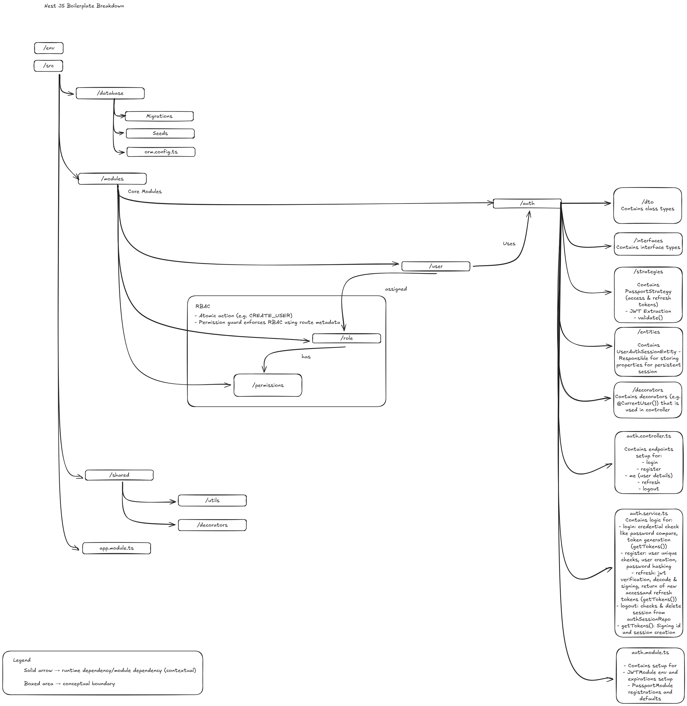

<p align="center">
  <a href="http://nestjs.com/" target="blank"></a>
</p>

[circleci-image]: https://img.shields.io/circleci/build/github/nestjs/nest/master?token=abc123def456
[circleci-url]: https://circleci.com/gh/nestjs/nest

  <p align="center">A progressive <a href="http://nodejs.org" target="_blank">Node.js</a> framework for building efficient and scalable server-side applications.</p>
    <p align="center">
<a href="https://www.npmjs.com/~nestjscore" target="_blank"></a>
<a href="https://www.npmjs.com/~nestjscore" target="_blank"></a>
<a href="https://www.npmjs.com/~nestjscore" target="_blank"></a>
<a href="https://circleci.com/gh/nestjs/nest" target="_blank"></a>
<a href="https://discord.gg/G7Qnnhy" target="_blank"></a>
<a href="https://opencollective.com/nest#backer" target="_blank"></a>
<a href="https://opencollective.com/nest#sponsor" target="_blank"></a>
  <a href="https://paypal.me/kamilmysliwiec" target="_blank"></a>
    <a href="https://opencollective.com/nest#sponsor"  target="_blank"></a>
  <a href="https://twitter.com/nestframework" target="_blank"></a>
</p>
  <!--[](https://opencollective.com/nest#backer)
  [](https://opencollective.com/nest#sponsor)-->

## Description

## 🏗️ Architecture Overview

This project follows a modular NestJS architecture with JWT-based authentication and RBAC (Role-Based Access Control) enforced via guards and route metadata. The structure is inspired by a mentor’s NestJS architecture.



# 📦 Dependencies Overview

This document groups project dependencies by responsibility and explains
**what each group and package is used for**.  
The actual `package.json` remains flat as required by npm.

---

## 🧠 Core NestJS Framework

Fundamental runtime and framework building blocks for a NestJS application.

- **@nestjs/common** – Core NestJS decorators, helpers, and utilities (`@Injectable`, `@Controller`, etc.)
- **@nestjs/core** – NestJS application bootstrap, DI container, and lifecycle
- **@nestjs/platform-express** – Express.js adapter used by NestJS HTTP server
- **reflect-metadata** – Enables decorator metadata used by NestJS and TypeORM
- **rxjs** – Reactive programming primitives used internally by NestJS

---

## ⚙️ Configuration & Environment

Loading, managing, and accessing environment variables and app configuration.

- **@nestjs/config** – NestJS-native configuration module with DI support
- ~~**dotenv** – Loads environment variables from `.env`-style files~~

---

## 🔐 Authentication & Authorization (Auth Domain)

JWT-based authentication, Passport strategies, and password security.

- **@nestjs/passport** – NestJS integration layer for Passport strategies
- **@nestjs/jwt** – NestJS wrapper around `jsonwebtoken` with DI support
- **passport-jwt** – Passport strategy for extracting and validating JWTs
- **jsonwebtoken** – Core library for signing and verifying JWT tokens
- **bcryptjs** – Password hashing and comparison (user credential security)

---

## 🧩 CQRS / Architectural Patterns

Implements Command Query Responsibility Segregation and domain events. (POC only)

- **@nestjs/cqrs** – CQRS helpers for commands, queries, handlers, and events

---

## 🗄️ Database & ORM

Database access, ORM mapping, and SQL driver.

- **@nestjs/typeorm** – NestJS integration for TypeORM with DI support
- **typeorm** – ORM for entity mapping, repositories, and migrations
- **mysql2** – MySQL database driver used by TypeORM

- **@dataui/crud** – CRUD framework for NestJS, inspired by **@nestjsx/crud**, with declarative endpoint generation
- **@dataui/crud-typeorm** – TypeORM adapter for **@dataui/crud** enabling repository-based CRUD operations

---

## 🧪 Validation & Serialization

Request validation and DTO transformation.

- **class-validator** – Declarative validation for DTOs and request payloads
- **class-transformer** – Transforms plain objects into class instances

---

## 📚 API Documentation

Auto-generated API documentation.

- **@nestjs/swagger** – Swagger / OpenAPI integration for NestJS

---

</br>
</br>
</br>

# 🛠️ DevDependencies

## 🧱 NestJS Tooling

Development and scaffolding tools provided by NestJS.

- **@nestjs/cli** – CLI for generating, building, and running NestJS apps
- **@nestjs/schematics** – Code generators used by the NestJS CLI
- **@nestjs/testing** – Testing utilities for NestJS modules and providers

---

## 🧪 Testing

Unit, integration, and end-to-end testing tools.

- **jest** – Test runner and assertion framework
- **ts-jest** – TypeScript preprocessor for Jest
- **supertest** – HTTP assertions for API testing
- **@types/jest** – TypeScript typings for Jest
- **@types/supertest** – TypeScript typings for Supertest

---

## 🧹 Linting & Formatting

Code quality enforcement and formatting consistency.

- **eslint** – JavaScript / TypeScript linter
- **@eslint/js** – Core ESLint rule set
- **@eslint/eslintrc** – ESLint configuration helpers
- **eslint-config-prettier** – Disables ESLint rules that conflict with Prettier
- **eslint-plugin-prettier** – Runs Prettier as an ESLint rule
- **prettier** – Opinionated code formatter
- **globals** – Common global variables for ESLint configs
- **typescript-eslint** – TypeScript-aware ESLint rules and parser

---

## 🧠 TypeScript & Build Tooling

Compilation, runtime execution, and path resolution.

- **typescript** – TypeScript compiler
- **ts-node** – Execute TypeScript directly in Node.js
- **ts-loader** – TypeScript loader for build tools
- **tsconfig-paths** – Runtime support for TS path aliases
- **@types/node** – Node.js type definitions
- **@types/express** – Express.js type definitions

---

## 🔍 Debugging & Developer Experience

Improves runtime error reporting and debugging.

- **source-map-support** – Maps stack traces back to original TypeScript source

---

## ✅ Notes

- Dependencies are grouped conceptually for clarity; `package.json` remains flat.
- This setup is production-ready and aligns with NestJS + CQRS best practices.
- Each dependency serves a clear architectural role (auth, DB, config, tooling).

---

## Project setup

```bash
$ npm install
```

## Compile and run the project

```bash
# development
$ npm run start

# watch mode
$ npm run start:dev

# production mode
$ npm run start:prod
```

## Run tests

```bash
# unit tests
$ npm run test

# e2e tests
$ npm run test:e2e

# test coverage
$ npm run test:cov
```

## Deployment

When you're ready to deploy your NestJS application to production, there are some key steps you can take to ensure it runs as efficiently as possible. Check out the [deployment documentation](https://docs.nestjs.com/deployment) for more information.

If you are looking for a cloud-based platform to deploy your NestJS application, check out [Mau](https://mau.nestjs.com), our official platform for deploying NestJS applications on AWS. Mau makes deployment straightforward and fast, requiring just a few simple steps:

```bash
$ npm install -g @nestjs/mau
$ mau deploy
```

With Mau, you can deploy your application in just a few clicks, allowing you to focus on building features rather than managing infrastructure.

## Resources

Check out a few resources that may come in handy when working with NestJS:

- Visit the [NestJS Documentation](https://docs.nestjs.com) to learn more about the framework.
- For questions and support, please visit our [Discord channel](https://discord.gg/G7Qnnhy).
- To dive deeper and get more hands-on experience, check out our official video [courses](https://courses.nestjs.com/).
- Deploy your application to AWS with the help of [NestJS Mau](https://mau.nestjs.com) in just a few clicks.
- Visualize your application graph and interact with the NestJS application in real-time using [NestJS Devtools](https://devtools.nestjs.com).
- Need help with your project (part-time to full-time)? Check out our official [enterprise support](https://enterprise.nestjs.com).
- To stay in the loop and get updates, follow us on [X](https://x.com/nestframework) and [LinkedIn](https://linkedin.com/company/nestjs).
- Looking for a job, or have a job to offer? Check out our official [Jobs board](https://jobs.nestjs.com).

## Support

Nest is an MIT-licensed open source project. It can grow thanks to the sponsors and support by the amazing backers. If you'd like to join them, please [read more here](https://docs.nestjs.com/support).

## Stay in touch

- Author - [Kamil Myśliwiec](https://twitter.com/kammysliwiec)
- Website - [https://nestjs.com](https://nestjs.com/)
- Twitter - [@nestframework](https://twitter.com/nestframework)

## License

Nest is [MIT licensed](https://github.com/nestjs/nest/blob/master/LICENSE).
